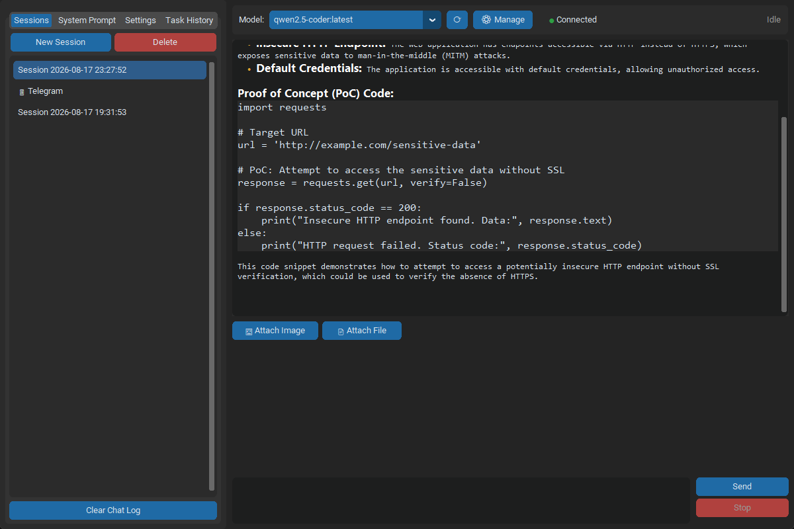
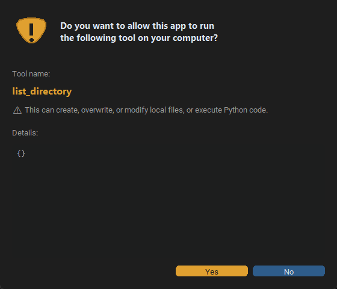
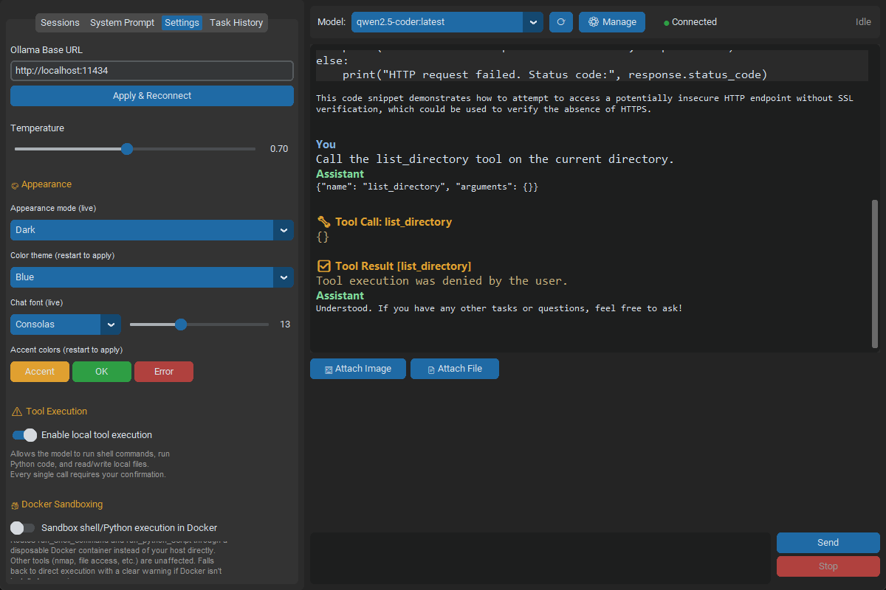
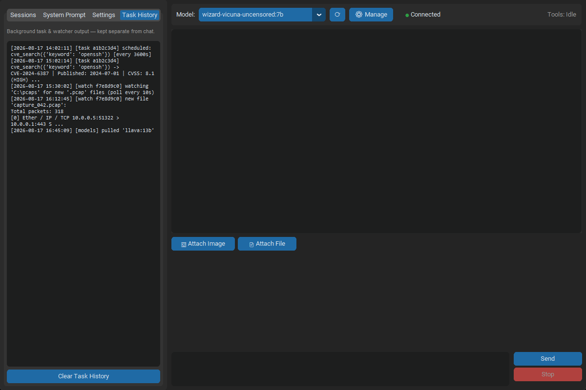
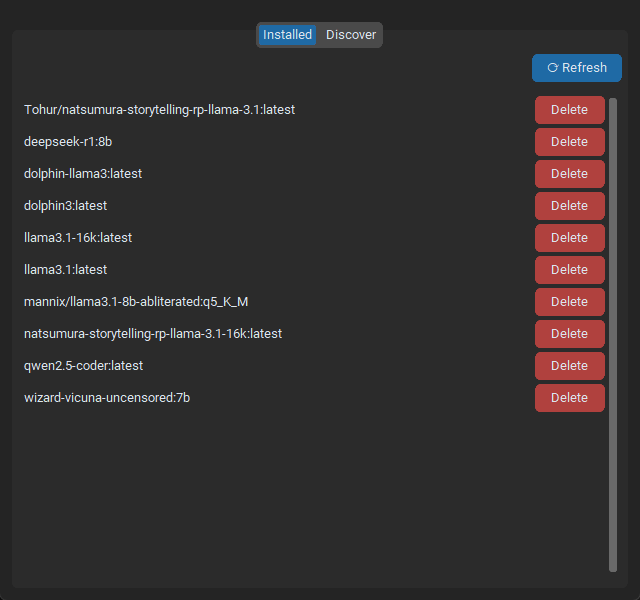
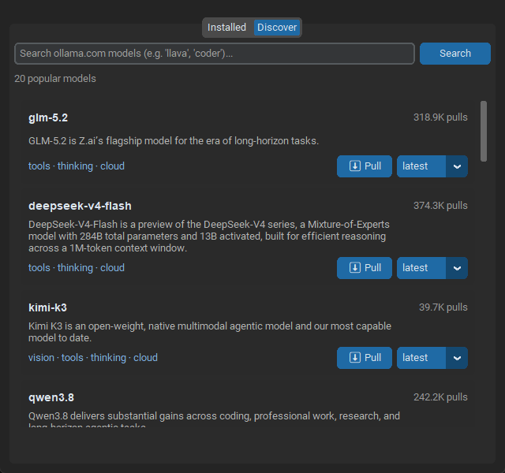

# Local AI Assistant

A local, unrestricted desktop AI assistant built on [Ollama](https://ollama.com) — your own "local-ish LLM" workstation, with a real tool-calling framework, vision, background automation, remote access via Telegram, and a safety model borrowed from Windows itself: every tool call gets a UAC-style Yes/No prompt before it runs.

Runs entirely on your machine. No cloud API, no accounts, no telemetry — your conversations, memory, and files never leave your computer unless you explicitly wire up something that does (Telegram, web search, CVE lookups).

## Screenshots

| | |
|---|---|
| **Chat with markdown rendering** | **Tool confirmation dialog** |
|  |  |
| **Appearance settings** | **Task History** |
|  |  |
| **Model manager — installed** | **Model manager — discover** |
|  |  |

## Why this exists

Most "local LLM" front-ends are chat boxes with a model picker. This is closer to an actual assistant: it can read and write your files, run commands, scan a network, remember things across sessions, search the web, and act on a schedule — all gated behind an explicit confirmation step you control, and all swappable between whatever models you have pulled in Ollama.

It's built with a security-research bent (the default system prompt assumes authorized pentesting/CTF/exploit-analysis work), but nothing about the architecture is specific to that — swap the system prompt and it's just as much a coding assistant, a research tool, or a home-automation brain.

## Features

- **Any local model** — dropdown to switch models mid-conversation without losing context; built-in model manager to search, pull, and delete Ollama models from inside the app.
- **Real tool-calling, real safety** — 24 built-in tools (below) the model can invoke, each gated by a master on/off toggle and a per-call confirmation dialog styled after Windows UAC. Works even with models that don't support Ollama's native tool-calling API, via a JSON fallback protocol.
- **Workspace folders** — point it at a project folder ("📁 Folder") and it works inside it like a CLI coding agent: relative paths in file/search tools resolve against it, shell commands run in it, and the model is handed a file tree of the project automatically. Optional hard-sandbox mode confines all file/shell access to the folder.
- **Manage Tools** — a browser (like Manage Models) listing every tool by category with its description and parameters, plus a switch to enable/disable individual tools — turn off `run_shell_command` specifically while leaving the rest on, for example.
- **Recursive code search** — `search_in_files` greps across a whole project to find where something is defined or used.
- **In-app Help guide** — a Help tab covering tool usage, the confirmation model, and adding/finding/removing tools.
- **Diff preview on write** — when the model wants to `write_file` or `patch_file` an existing file, the confirmation dialog shows a colored before/after diff instead of raw content, so you see exactly what changes before approving.
- **Context meter** — a top-bar readout estimating how full the current conversation's context window is.
- **Vision** — attach images, or let the model take its own screenshot with `capture_screen` and see it.
- **File ingestion** — attach `.txt`, `.log`, `.py`, `.json`, `.csv`, `.pdf`, or `.pcap` files and their content gets folded into the prompt automatically.
- **Persistent memory** — a `remember`/`recall`/`forget` tool store that survives across sessions and restarts, separate from any one conversation's history.
- **Background automation** — schedule any tool to run on an interval or cron schedule, or watch a directory for new files, with output routed to a dedicated Task History panel instead of cluttering the chat.
- **Sandboxed execution (optional)** — route shell/Python tool calls through a disposable Docker container instead of your host, when Docker's available.
- **Report generation** — turn findings into a saved Markdown or Word report.
- **Telegram bridge** — message the assistant from your phone. Long-polling only (nothing exposed on your network), allowlisted by your Telegram user ID, and tool calls still get a Yes/No confirmation — just sent to Telegram instead of the desktop.
- **Local plugin folder** — drop a `.py` file in `tools/plugins/` to add your own tools, no packaging or registry required.
- **Themeable** — dark/light/system appearance, color theme, chat font, and accent colors, all in Settings.
- **Markdown-rendered chat** — code blocks, inline code, bold, headers, and lists render properly instead of as raw text.
- **Session persistence** — every conversation is saved locally (SQLite) and browsable from a sessions list.
- **Copy to clipboard** — one-click copy of the assistant's last reply, or right-click the chat log to copy a selection or the full transcript.
- **HexStrike AI integration (optional)** — point it at a locally/lab-hosted [HexStrike AI](https://github.com/0x4m4/hexstrike-ai) server (e.g. a Parrot/Kali VM on your own network) to run 80+ real pentesting tools (nmap, gobuster, sqlmap, hydra, metasploit, and more) through the same confirmation flow as every other tool. HexStrike has no built-in auth — only point this at a server on your own lab network.

## Quick start

Requires [Ollama](https://ollama.com) installed and running locally, with at least one model pulled (`ollama pull qwen2.5-coder` is a solid default), and Python 3.10+.

**Windows:**
```bash
launch.bat
```

**Linux/macOS:**
```bash
./launch.sh
```

Either script creates a virtual environment, installs dependencies, and starts the app. No manual setup beyond that.

To launch from a desktop icon on Windows instead of a terminal, see the `launch_silent.vbs` wrapper — it runs `launch.bat` with no console window, and can be pointed to by a `.lnk` shortcut.

## Requirements

- **Ollama**, running locally (default `http://localhost:11434`, configurable in Settings)
- **Python 3.10+**
- **Docker** (optional) — only needed if you enable sandboxed shell/Python execution
- **Nmap, subfinder/dnsrecon** (optional) — only needed for the recon tools that wrap them; they degrade gracefully with a clear message if missing

## Safety model

Tool execution is **off by default**. When enabled, every single tool call — whether triggered from the desktop or from Telegram — shows a confirmation dialog with the tool name, a plain-language description of what it can do, and the exact arguments, before anything runs. Scheduled/background tasks are the one exception in spirit but not in practice: *creating* a schedule goes through the same confirmation once, and after that it runs unattended (that's the point of automation), but it still respects the master toggle — flipping tool execution off pauses all background jobs immediately — and every execution is logged to Task History for a full audit trail.

This is a genuinely unrestricted tool — it will run the shell commands you approve, including destructive ones. The confirmation dialog is a speed bump for your own attention, not a sandbox. Read what you're approving.

## Available tools

| Category | Tool | What it does |
|---|---|---|
| dev | `read_file` | Read a local text/code/config file |
| dev | `write_file` | Create or overwrite a local file |
| dev | `patch_file` | Replace one unique occurrence of text in a file |
| dev | `run_python_script` | Run a local script or inline Python |
| dev | `list_directory` | List a directory's contents |
| dev | `search_in_files` | Recursively grep a folder for text (find definitions/usages) |
| recon | `nmap_scan` | Run an Nmap scan against a target |
| recon | `parse_nmap_file` | Parse a saved `.nmap`/`.xml` Nmap output file |
| recon | `inspect_web_target` | Fetch HTTP headers and TLS cert info for a URL |
| recon | `subdomain_recon` | Passive subdomain discovery (subfinder/dnsrecon) |
| security | `run_shell_command` | Run a shell command (optionally sandboxed) |
| security | `crypto_utility` | Base64/hex/URL encode-decode, hashing, JWT decode |
| vision | `capture_screen` | Screenshot the desktop into the conversation |
| automation | `schedule_task` | Run any tool on an interval/cron/one-shot schedule |
| automation | `list_scheduled_tasks` | List active scheduled tasks and watches |
| automation | `cancel_task` | Cancel a scheduled task or watch |
| automation | `watch_directory` | Auto-summarize new files dropped in a folder |
| research | `web_search` | Search the web (Brave API or DuckDuckGo fallback) |
| memory | `remember` / `recall` / `forget` / `list_memories` | Persistent cross-session fact store |
| report | `generate_report` | Save findings as a Markdown/Word report |
| vuln | `cve_lookup` / `cve_search` | Query the NVD vulnerability database |
| hexstrike | `hexstrike_health` / `hexstrike_list_tools` / `hexstrike_run_tool` | Run real pentesting tools via a lab-hosted [HexStrike AI](https://github.com/0x4m4/hexstrike-ai) server (optional, off by default) |

Plus anything you add yourself via `tools/plugins/` — see that folder's `README.md`.

## Configuration

Everything is in the Settings tab: Ollama connection, temperature, tool execution toggle, Docker sandboxing, Telegram bot setup, web search / CVE API keys, plugin management, and appearance (theme, font, colors). Config is stored locally in `data/config.json`; conversation history and memory in `data/history.db` (SQLite); nothing is synced anywhere.

## Architecture

- `main.py` — CustomTkinter GUI, threading/event-queue glue between the UI thread and background work
- `chat_engine.py` — the streaming chat + tool-calling round trip, shared identically by the desktop GUI and the Telegram bridge so the two surfaces can't drift apart
- `ollama_client.py` — thin HTTP client for the Ollama API (chat, model management, capability detection)
- `telegram_bridge.py` — long-polling Telegram Bot API client
- `db.py` — SQLite persistence (sessions, messages, memory)
- `config.py` — JSON-backed settings
- `tools/` — the tool-calling framework: a central registry (`tools/registry.py`), one module per tool category, and `tools/plugins/` for your own additions

## License

MIT — see [LICENSE](LICENSE).
